# Panduan Penginputan Keuangan & Pelaporan SiKeu

**Versi:** 1.0  
**Tanggal:** Juli 2026  
**Sistem:** SiKeu — Sistem Pelaporan Keuangan PCNU Kab. Magelang  
**URL Live:** https://keuangan.numartmagelang.com  

---

## Daftar Isi

1. [Pendahuluan](#1-pendahuluan)
2. [Persiapan Awal](#2-persiapan-awal)
3. [Login ke Sistem](#3-login-ke-sistem)
4. [Setup Perusahaan](#4-setup-perusahaan)
5. [Daftar Akun (Chart of Accounts)](#5-daftar-akun-chart-of-accounts)
6. [Input Transaksi Manual](#6-input-transaksi-manual)
7. [Import Transaksi CSV](#7-import-transaksi-csv)
8. [Dashboard Keuangan](#8-dashboard-keuangan)
9. [Fitur Laporan Keuangan](#9-fitur-laporan-keuangan)
10. [Alur Pelaporan Lengkap](#10-alur-pelaporan-lengkap)
11. [Peran User (Admin, Editor, Viewer)](#11-peran-user-admin-editor-viewer)
12. [FAQ & Troubleshooting](#12-faq--troubleshooting)

---

## 1. Pendahuluan

**SiKeu** adalah sistem pencatatan dan pelaporan keuangan berbasis web. Modul keuangan mencakup:

- Pencatatan transaksi double-entry (debit & kredit)
- Chart of accounts (daftar akun)
- Laporan keuangan: Rekap Transaksi, Neraca Saldo, Laba Rugi, Arus Kas, Jurnal Umum

### Alur kerja singkat

```
Login → Setup Perusahaan → Daftar Akun → Input Transaksi → Generate Laporan
```

---

## 2. Persiapan Awal

Sebelum input transaksi, pastikan:

| No | Persyaratan | Halaman |
|----|-------------|---------|
| 1 | Punya akun login (dibuat admin) | `/login.php` |
| 2 | Perusahaan default sudah di-set | `/pengaturan/perusahaan.php` |
| 3 | Daftar akun (COA) sudah lengkap | `/akun/index.php` |
| 4 | Role user = **Admin** atau **Editor** | — |

> **Viewer** hanya bisa melihat dashboard dan laporan, tidak bisa input transaksi.

---

## 3. Login ke Sistem

### Langkah-langkah

1. Buka browser → `https://keuangan.numartmagelang.com/login.php`
2. Isi **Email atau Username**
3. Isi **Password**
4. (Opsional) centang **Remember me**
5. Klik **Masuk**


Setelah login berhasil, Anda diarahkan ke **Dashboard** (`/index.php`).

---

## 4. Setup Perusahaan

**Menu:** Pengaturan → Perusahaan  
**URL:** `/pengaturan/perusahaan.php`

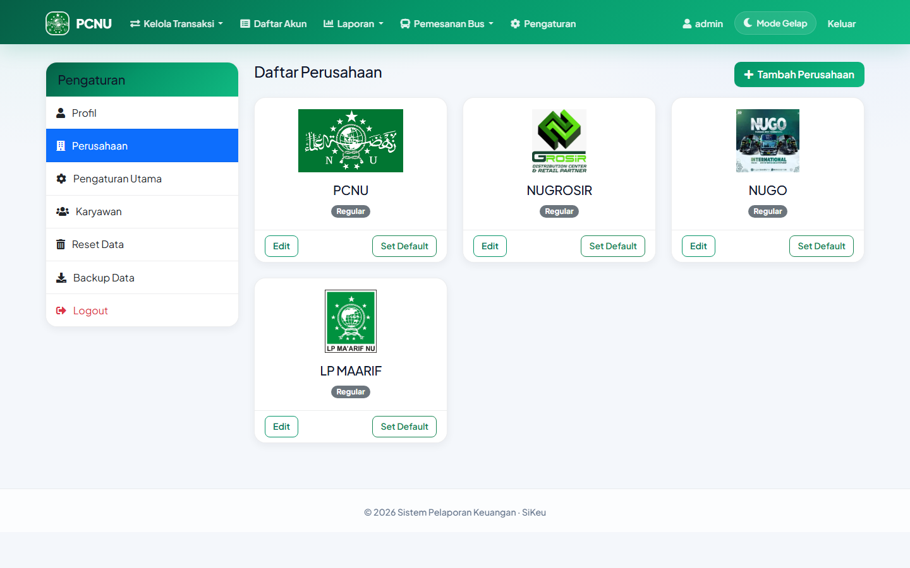

### Tambah perusahaan baru

1. Klik **Tambah Perusahaan**
2. Isi form:
   - **Nama** (wajib)
   - Alamat, Telepon, Email, Website (opsional)
   - **Logo** perusahaan (JPG/PNG)
3. Klik **Simpan**
4. Klik **Set Default** pada perusahaan yang aktif

> Tanpa perusahaan default, sistem akan redirect ke halaman ini saat input transaksi.

---

## 5. Daftar Akun (Chart of Accounts)

**Menu:** Daftar Akun  
**URL:** `/akun/index.php`

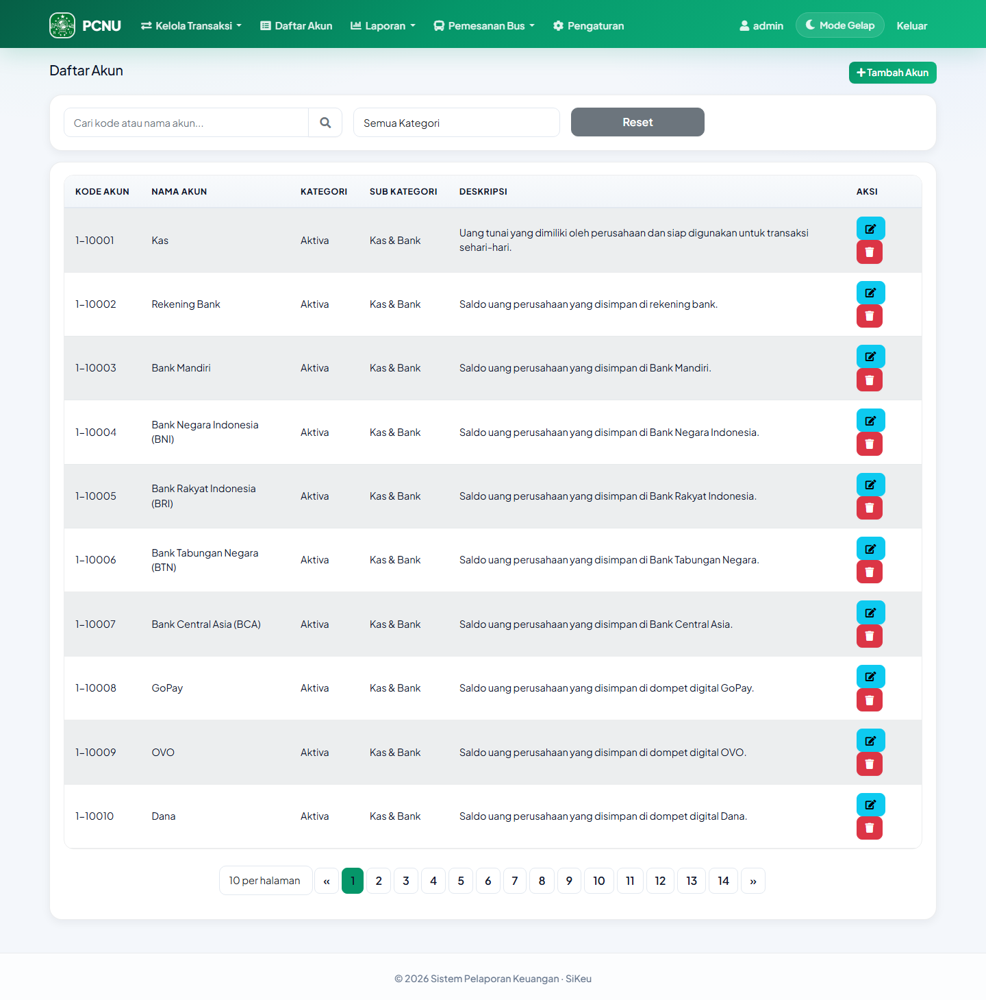

### Kategori akun

| Kategori | Fungsi | Dipakai di laporan |
|----------|--------|-------------------|
| **aktiva** | Kas, bank, aset | Neraca, Arus Kas |
| **pasiva** | Hutang | Neraca |
| **modal** | Modal pemilik | Neraca, Arus Kas Pendanaan |
| **pendapatan** | Pemasukan | Laba Rugi, Arus Kas Operasi |
| **beban** | Pengeluaran/biaya | Laba Rugi, Arus Kas Operasi |

### Tambah akun

1. Klik **Tambah Akun**
2. Isi **Kode Akun**, **Nama Akun**, **Kategori**, Deskripsi
3. Klik **Simpan**

### Akun minimal yang disarankan

- 1 akun **aktiva** (contoh: Kas)
- 1 akun **pendapatan**
- 1 akun **beban**
- 1 akun **modal** (opsional)

---

## 6. Input Transaksi Manual

**Menu:** Kelola Transaksi → Tambah Transaksi  
**URL:** `/transaksi/tambah.php`

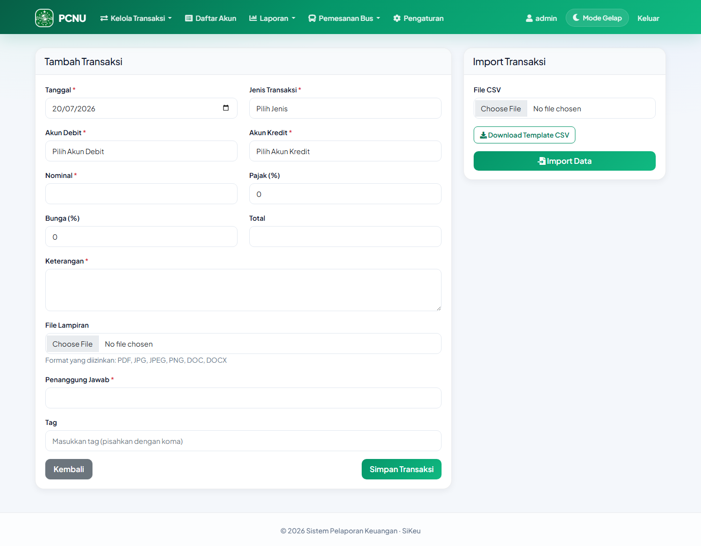

### Jenis transaksi (9 jenis)

| Jenis | Kegunaan |
|-------|----------|
| **Pemasukan** | Uang masuk dari pendapatan |
| **Pengeluaran** | Uang keluar untuk biaya |
| **Hutang** | Menerima utang (kas masuk, hutang bertambah) |
| **Piutang** | Memberi piutang |
| **Tanam Modal** | Penambahan modal pemilik |
| **Tarik Modal** | Penarikan modal pemilik |
| **Transfer Uang** | Pindah antar akun kas/bank |
| **Pemasukan Piutang** | Pelunasan piutang |
| **Transfer Hutang** | Bayar hutang dengan kas |

### Field form transaksi

| Field | Wajib | Keterangan |
|-------|:-----:|------------|
| Tanggal | ✅ | Tanggal transaksi |
| Jenis Transaksi | ✅ | Pilih 1 dari 9 jenis |
| Akun Debit | ✅ | Otomatis difilter sesuai jenis |
| Akun Kredit | ✅ | Otomatis difilter sesuai jenis |
| Nominal | ✅ | Jumlah uang |
| Pajak (%) | — | Ditambahkan ke total |
| Bunga (%) | — | Ditambahkan ke total |
| Total | — | Otomatis (nominal + pajak + bunga) |
| Keterangan | ✅ | Catatan transaksi |
| File Lampiran | — | PDF, JPG, PNG, DOC |
| Penanggung Jawab | ✅ | Nama PJ / kontak |
| Tag | — | Pisahkan koma untuk filter laporan |

### Langkah input

1. Pilih **Jenis Transaksi** → akun debit/kredit otomatis terfilter
2. Pilih **Akun Debit** dan **Akun Kredit**
3. Isi **Nominal**, **Keterangan**, **Penanggung Jawab**
4. (Opsional) isi Tag, upload bukti
5. Klik **Simpan Transaksi**
6. Review di modal **Konfirmasi Transaksi** (preview jurnal)
7. Klik **Simpan** untuk finalisasi

### Daftar transaksi

**URL:** `/transaksi/index.php`

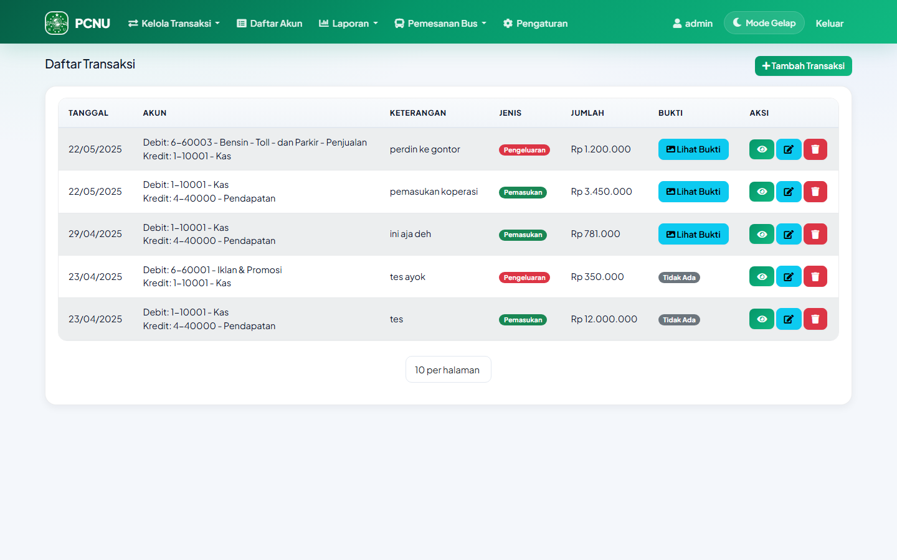

Dari sini Anda bisa **Lihat**, **Edit**, atau **Hapus** transaksi.

---

## 7. Import Transaksi CSV

**Menu:** Kelola Transaksi → Import CSV  
**URL:** `/transaksi/import.php`

Atau upload langsung dari sidebar form **Tambah Transaksi**.

### Format CSV (pemisah titik koma `;`)

```
Tanggal;Akun Debit;Akun Kredit;Keterangan;Jenis Transaksi;Penanggung Jawab;Tag;Jumlah
```

- **Akun Debit/Kredit** = ID numerik akun (bukan kode akun)
- **Jenis Transaksi** = pemasukan, pengeluaran, hutang, piutang, dll.
- Download template: `/transaksi/transaksi.csv`

---

## 8. Dashboard Keuangan

**URL:** `/index.php`

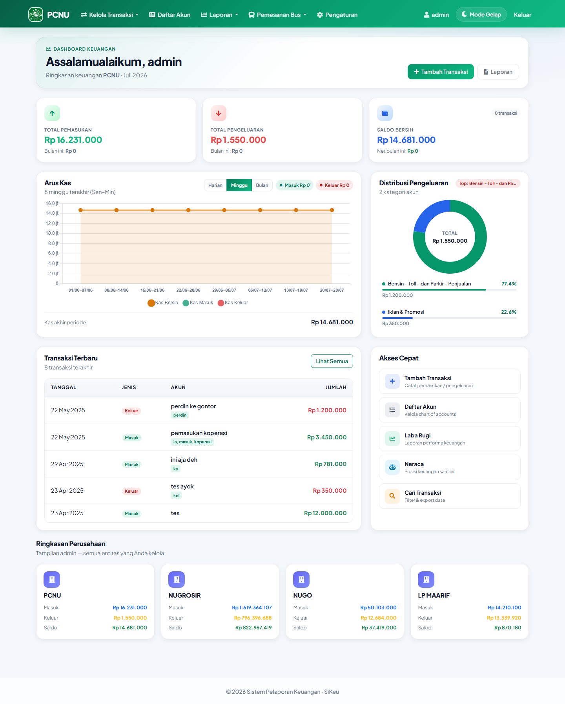

### Informasi di dashboard

- **Total Pemasukan, Pengeluaran, Saldo Bersih** (+ trend vs bulan lalu)
- **Grafik Arus Kas** (harian / mingguan / bulanan)
- **Distribusi Pengeluaran** (top 5 akun beban)
- **8 transaksi terbaru**
- **Akses cepat** ke Tambah Transaksi, Daftar Akun, Laba Rugi, Neraca

---

## 9. Fitur Laporan Keuangan

**Menu:** Laporan (dropdown navbar)

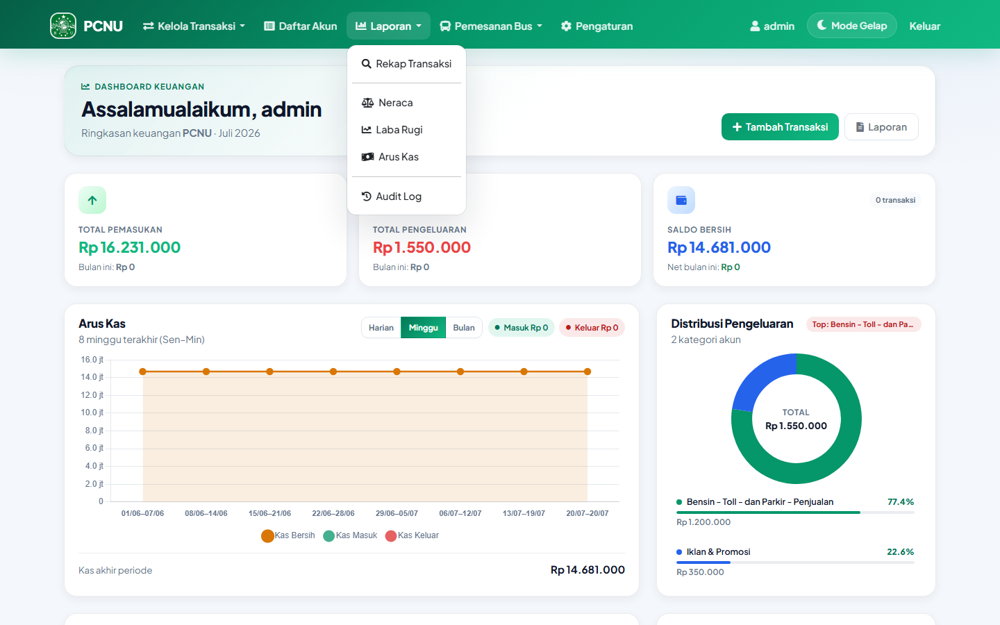

### 9.1 Rekap Transaksi

**URL:** `/laporan/transaksi.php`

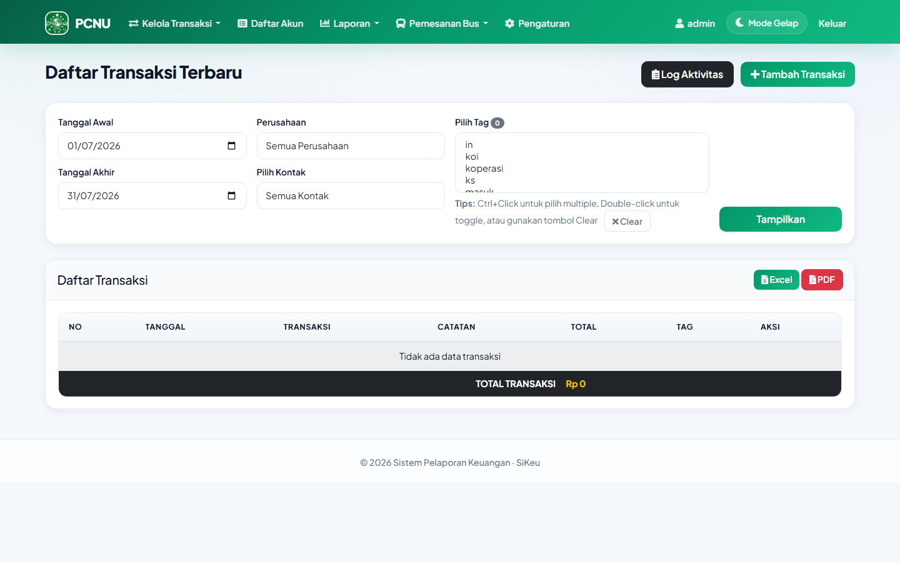

**Fungsi:** Daftar semua transaksi dengan filter.

**Filter:**
- Tanggal awal & akhir
- Perusahaan (admin)
- Kontak / Penanggung Jawab
- Tag (multi-select)

**Export:** Excel dan PDF

---

### 9.2 Neraca Saldo

**URL:** `/laporan/neraca.php`

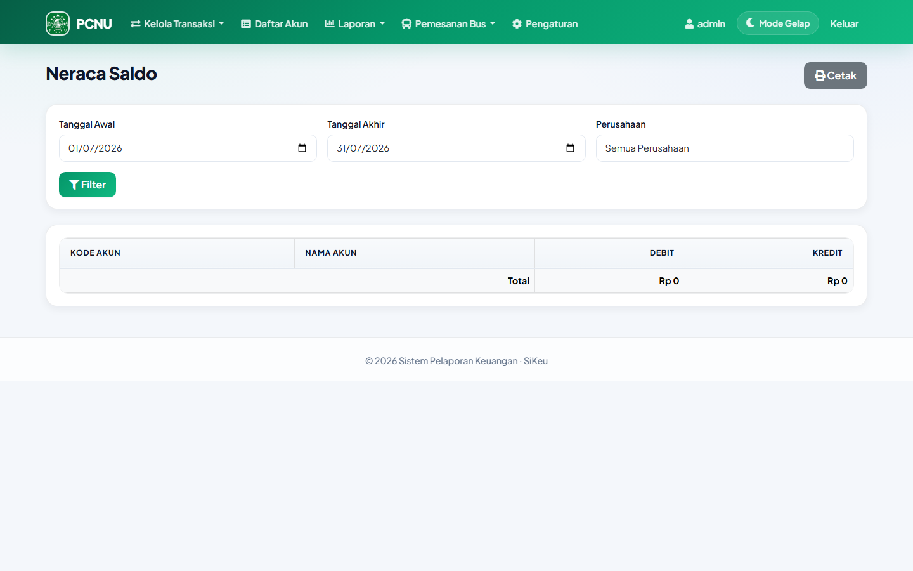

**Fungsi:** Trial balance — cek keseimbangan debit vs kredit per akun.

**Tab tersedia:**
- **Neraca Saldo** — semua akun debit/kredit
- **Neraca Keuangan (Aktiva/Pasiva)** — posisi keuangan per kategori

**Filter:** Tanggal awal, tanggal akhir, perusahaan (admin)

---

### 9.3 Laba Rugi

**URL:** `/laporan/laba-rugi.php`

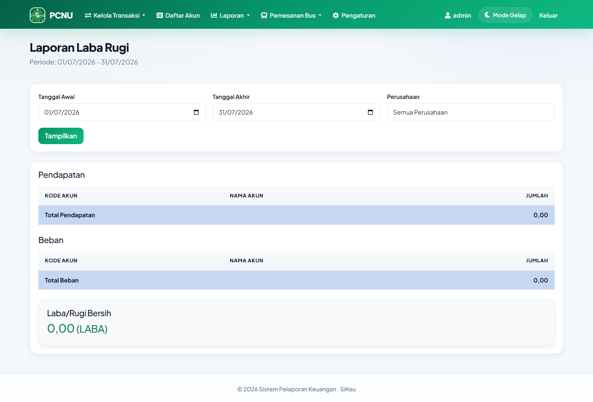

**Fungsi:** Menghitung profitabilitas periode.

**Struktur:**
- Total **Pendapatan** (akun kategori pendapatan)
- Total **Beban** (akun kategori beban)
- **Laba/Rugi Bersih** = Pendapatan − Beban

---

### 9.4 Arus Kas

**URL:** `/laporan/arus-kas.php`

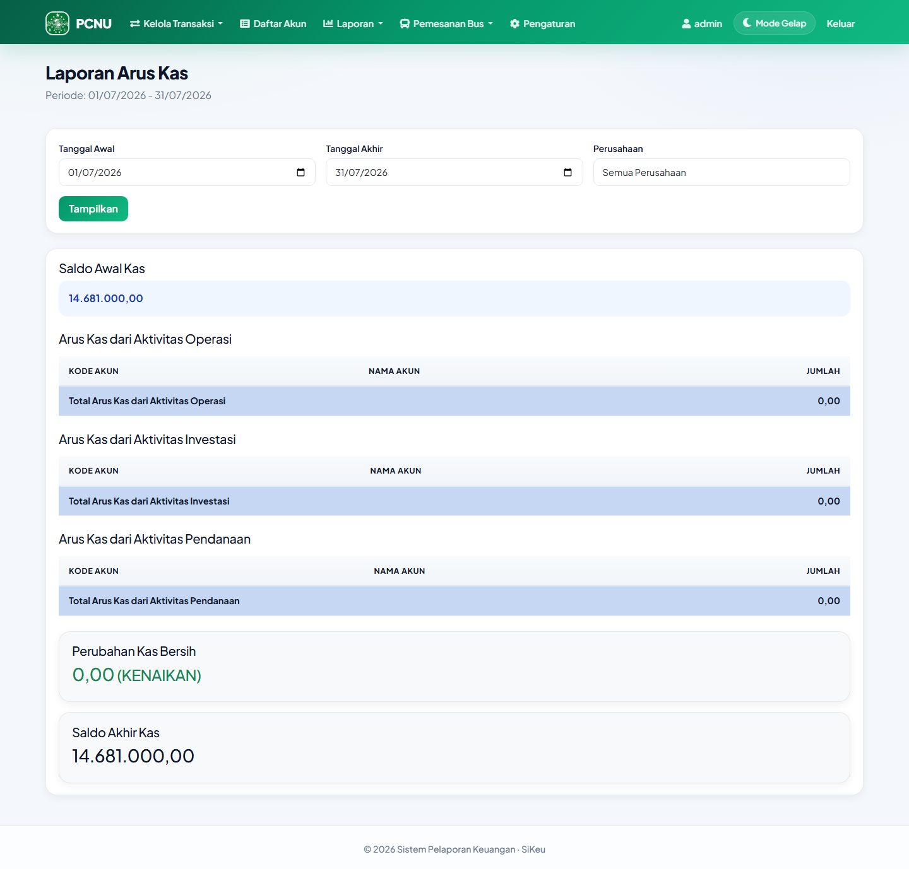

**Fungsi:** Pergerakan kas per periode.

**Struktur:**
1. Saldo awal kas
2. Arus kas operasi (pendapatan & beban)
3. Arus kas investasi
4. Arus kas pendanaan (modal)
5. Perubahan kas bersih & saldo akhir

---

### 9.5 Jurnal Umum

**URL:** `/laporan/jurnal.php`

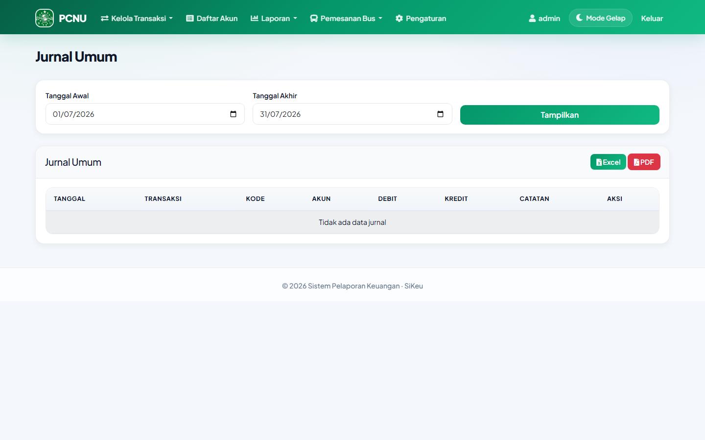

**Fungsi:** Verifikasi double-entry — setiap transaksi tampil sebagai baris debit & kredit.

**Export:** Excel/PDF (parameter `tipe=jurnal`)

> Jurnal Umum tidak ada di menu navbar — akses langsung via URL di atas.

---

## 10. Alur Pelaporan Lengkap

### Checklist penginputan → pelaporan

#### Fase A — Setup (sekali)

- [ ] Login ke sistem
- [ ] Buat/set perusahaan default
- [ ] Susun daftar akun dengan kategori benar
- [ ] (Admin) Undang tim via Pengaturan → Karyawan

#### Fase B — Input harian

- [ ] Catat **pemasukan** (jenis: Pemasukan)
- [ ] Catat **pengeluaran** (jenis: Pengeluaran)
- [ ] Catat hutang/piutang/modal/transfer sesuai kebutuhan
- [ ] Lengkapi **Penanggung Jawab** dan **Tag**
- [ ] Upload bukti transaksi jika ada

#### Fase C — Review & laporan

| Urutan | Laporan | Tujuan |
|--------|---------|--------|
| 1 | Dashboard | Cek KPI & trend |
| 2 | Rekap Transaksi | Detail + export |
| 3 | Jurnal Umum | Verifikasi debit = kredit |
| 4 | Neraca Saldo | Keseimbangan buku besar |
| 5 | Laba Rugi | Performa periode |
| 6 | Arus Kas | Pergerakan kas |

### Fitur wajib vs opsional

| Fitur | Wajib untuk laporan? |
|-------|---------------------|
| Setup perusahaan | ✅ Wajib |
| Daftar akun | ✅ Wajib |
| Input transaksi | ✅ Wajib |
| Tag & kontak | Opsional (memudahkan filter) |
| Import CSV | Opsional (bulk input) |
| Rekap Transaksi | ✅ Disarankan |
| Jurnal Umum | ✅ Disarankan (verifikasi) |
| Neraca Saldo | ✅ Wajib |
| Laba Rugi | ✅ Wajib |
| Arus Kas | ✅ Wajib |
| Audit Log | Opsional (admin only) |

---

## 11. Peran User (Admin, Editor, Viewer)

| Fitur | Admin | Editor | Viewer |
|-------|:-----:|:------:|:------:|
| Dashboard | ✅ | ✅ | ✅ |
| Tambah/Edit Transaksi | ✅ | ✅ | ❌ |
| Daftar Akun | ✅ | ✅ | ❌ |
| Import CSV | ✅ | ✅ | ❌ |
| Semua Laporan | ✅ | ✅ | ✅ |
| Filter multi-perusahaan | ✅ | ❌ | ❌ |
| Audit Log | ✅ | ❌ | ❌ |
| Pengaturan | ✅ | ✅ | ❌ |
| Reset Data | ✅ | ❌ | ❌ |

**Viewer** otomatis diarahkan ke halaman laporan jika mencoba akses menu input.

---

## 12. FAQ & Troubleshooting

### Tidak bisa input transaksi?

Pastikan perusahaan default sudah di-set di Pengaturan → Perusahaan.

### Saldo tidak mencukupi?

Terjadi pada pengeluaran/tarik modal/transfer jika saldo akun kas kurang.

### Total debit ≠ kredit di neraca saldo?

Cek jurnal umum — kemungkinan ada transaksi dengan pasangan akun salah.

### Export laporan menampilkan semua perusahaan?

Pastikan filter perusahaan sudah dipilih. User non-admin otomatis terfilter ke perusahaan default.

### Import CSV gagal?

- Pastikan ID akun benar (numerik, bukan kode akun)
- Pemisah kolom harus titik koma (`;`)
- Jenis transaksi harus sesuai 9 jenis yang valid

---

## Kontak

Hubungi **Administrator Sistem** perusahaan Anda untuk pembuatan akun, reset password, dan assign role.

---

*Dokumen ini dibuat otomatis dari Sistem SiKeu — https://keuangan.numartmagelang.com*
