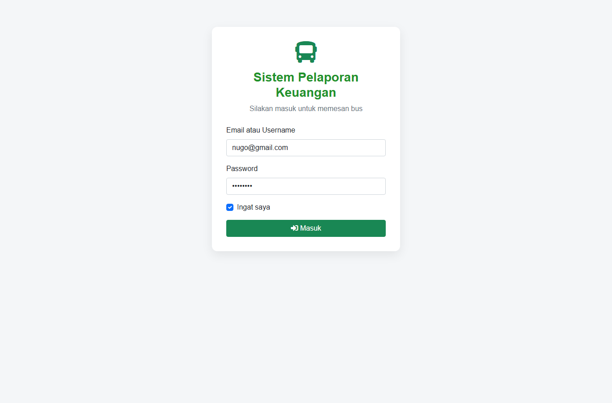
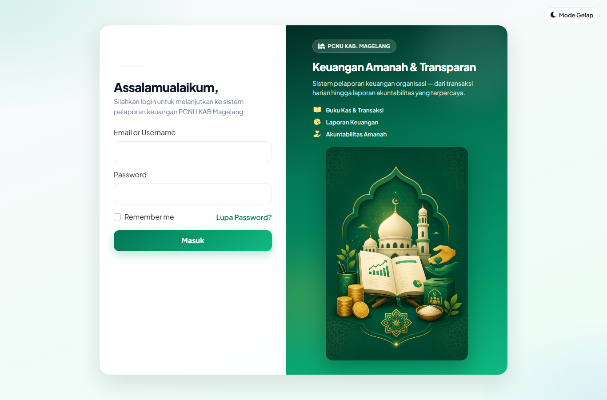
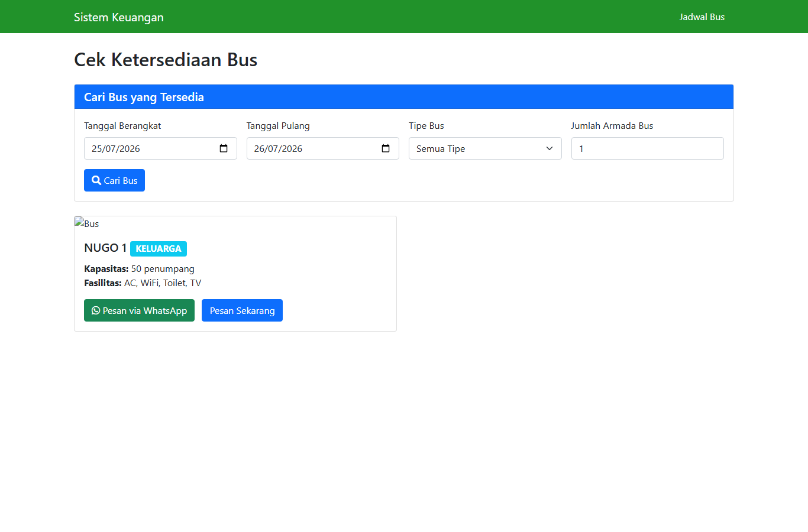
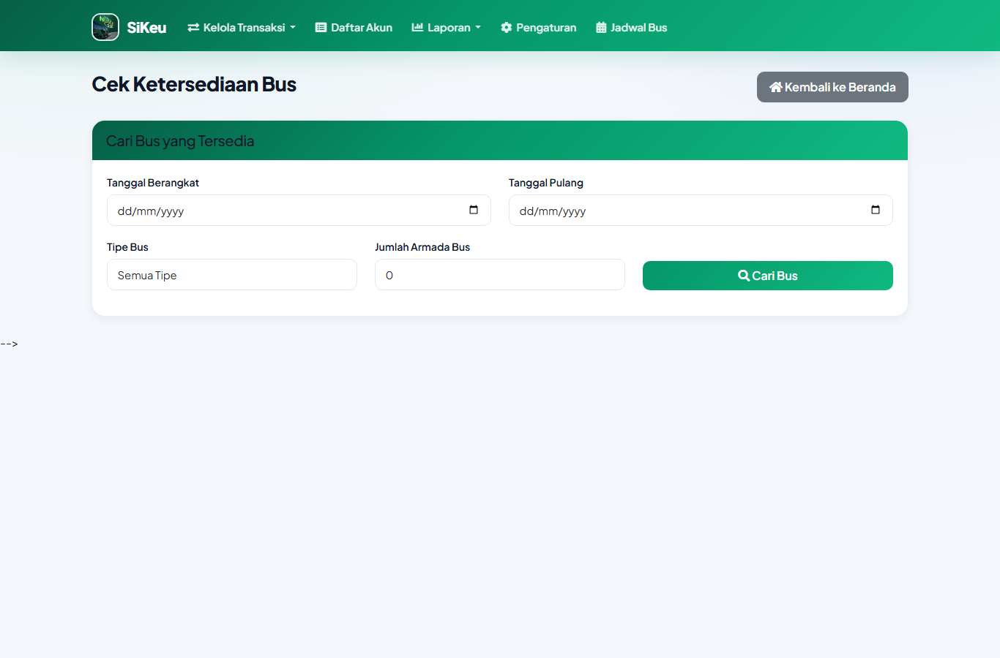
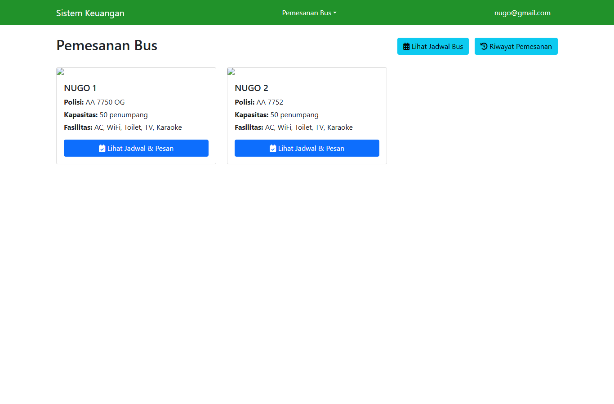
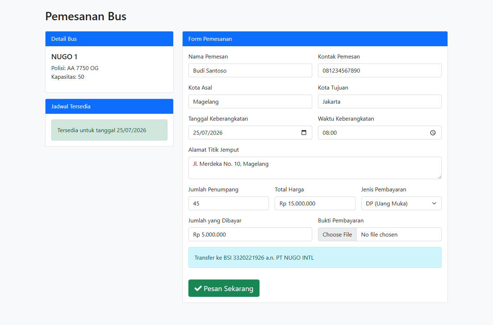
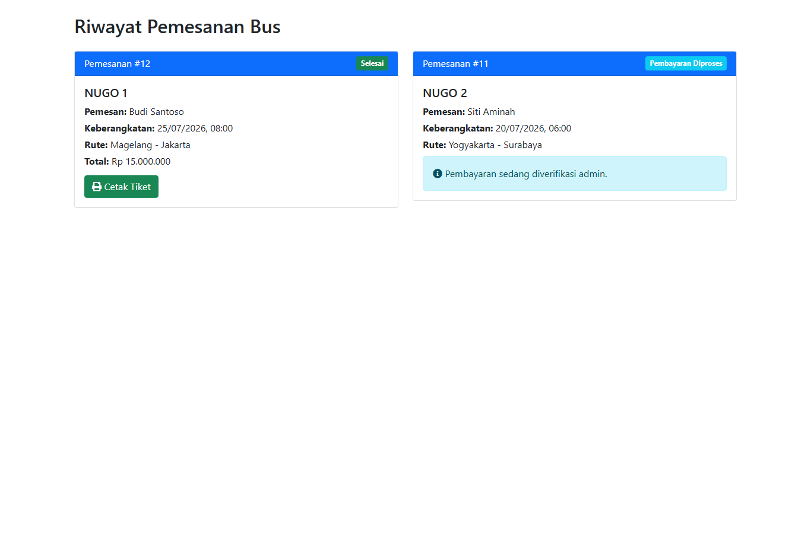
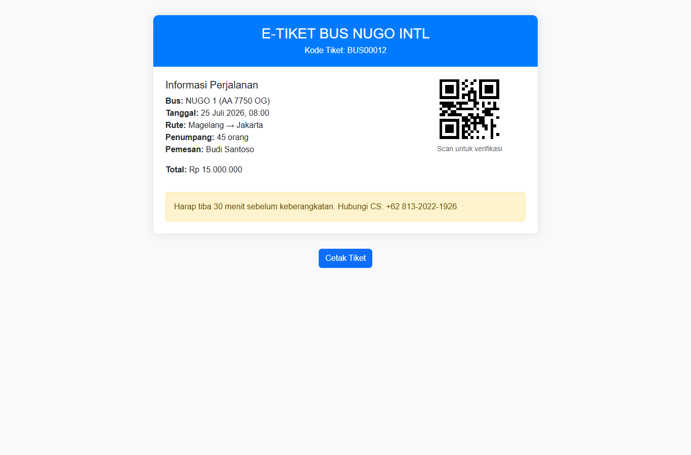

# Panduan Pengguna Sistem Pemesanan Bus NUGO INTL

**Versi:** 1.0  
**Tanggal:** Juli 2026  
**Sistem:** Sistem Pelaporan Keuangan — Modul Pemesanan Bus  

---

## Daftar Isi

1. [Pendahuluan](#1-pendahuluan)
2. [Persyaratan Akses](#2-persyaratan-akses)
3. [Login ke Sistem](#3-login-ke-sistem)
4. [Menu Pemesanan Bus](#4-menu-pemesanan-bus)
5. [Cek Ketersediaan Bus (Pengunjung)](#5-cek-ketersediaan-bus-pengunjung)
6. [Dashboard Bus](#6-dashboard-bus)
7. [Membuat Pemesanan Bus](#7-membuat-pemesanan-bus)
8. [Pembayaran dan Upload Bukti](#8-pembayaran-dan-upload-bukti)
9. [Riwayat Pemesanan](#9-riwayat-pemesanan)
10. [Status Pemesanan](#10-status-pemesanan)
11. [Mencetak Tiket Bus](#11-mencetak-tiket-bus)
12. [Pemesanan via WhatsApp (Tanpa Login)](#12-pemesanan-via-whatsapp-tanpa-login)
13. [Aturan dan Validasi Sistem](#13-aturan-dan-validasi-sistem)
14. [FAQ & Troubleshooting](#14-faq--troubleshooting)

---

## 1. Pendahuluan

Modul **Pemesanan Bus** digunakan untuk memesan armada bus NUGO INTL secara online. Fitur ini tersedia bagi:

- **Pengunjung umum** — cek ketersediaan bus dan pesan via WhatsApp tanpa login
- **User terdaftar NUGO** — pemesanan langsung melalui sistem, upload bukti bayar, lacak status, dan cetak e-tiket

### URL Penting

| Halaman | URL |
|---------|-----|
| Login | `/login.php` |
| Jadwal Bus (publik) | `/jadwal_bus_umum.php` |
| Dashboard Bus | `/bus/index.php` |
| Form Pemesanan | `/bus/pesan.php?id={id_bus}` |
| Riwayat Pemesanan | `/bus/riwayat.php` |
| Cetak Tiket | `/bus/cetak_tiket.php?id={id_pemesanan}` |

---

## 2. Persyaratan Akses

### Akun user bus

1. Akun dibuat oleh **Admin Perusahaan** melalui menu Pengaturan → Karyawan
2. User harus terhubung ke perusahaan **NUGO** dengan status **aktif**
3. Tidak ada fitur registrasi mandiri — hubungi admin jika belum punya akun

### Perbedaan akses

| Fitur | Pengunjung | User NUGO |
|-------|:----------:|:---------:|
| Cek ketersediaan bus | ✅ | ✅ |
| Pesan via WhatsApp | ✅ | ✅ |
| Pesan langsung di sistem | ❌ | ✅ |
| Riwayat pemesanan | ❌ | ✅ |
| Upload bukti pembayaran | ❌ | ✅ |
| Cetak e-tiket | ❌ | ✅ (status Selesai) |

---

## 3. Login ke Sistem

### Langkah-langkah

1. Buka browser (Chrome, Firefox, atau Edge)
2. Akses alamat sistem, contoh: `https://keuangan.numartmagelang.com/login.php`
3. Isi **Email atau Username** dan **Password** yang diberikan admin
4. Centang **Ingat saya** jika menggunakan komputer pribadi (opsional)
5. Klik tombol **Masuk**



### Catatan

- Jika lupa password, hubungi administrator sistem
- Setelah login berhasil, Anda diarahkan ke Dashboard Keuangan
- User NUGO akan melihat menu **Pemesanan Bus** di navbar hijau



---

## 4. Menu Pemesanan Bus

Setelah login sebagai user NUGO, klik menu **Pemesanan Bus** di navbar. Submenu yang tersedia:

| Menu | Fungsi |
|------|--------|
| **Dashboard Bus** | Daftar bus tersedia & pemesanan |
| **Operasional Bus** | Monitoring operasional (operator) |
| **Laporan Bulanan** | Laporan bulanan armada |
| **Import dari Dokumen** | Import data laporan |

Untuk user pemesan, menu yang paling sering digunakan adalah **Dashboard Bus**.

---

## 5. Cek Ketersediaan Bus (Pengunjung)

Halaman ini dapat diakses **tanpa login** melalui menu **Jadwal Bus** atau URL `/jadwal_bus_umum.php`.

### Langkah pencarian

1. Isi **Tanggal Berangkat** (wajib)
2. Isi **Tanggal Pulang** (wajib)
3. Pilih **Tipe Bus** (opsional — Semua Tipe / VIP / KELUARGA)
4. Isi **Jumlah Armada Bus** (opsional)
5. Klik **Cari Bus**



### Hasil pencarian

Sistem menampilkan kartu bus yang **tersedia** pada tanggal yang dipilih. Setiap kartu berisi:

- Foto bus
- Nama bus & tipe
- Kapasitas penumpang
- Fasilitas (AC, WiFi, Toilet, dll.)

Tombol aksi:
- **Pesan via WhatsApp** — untuk pengunjung tanpa akun
- **Pesan Sekarang** — muncul jika sudah login, langsung ke form pemesanan



---

## 6. Dashboard Bus

Akses: **Pemesanan Bus → Dashboard Bus** atau `/bus/index.php`



### Fitur dashboard

| Tombol | Fungsi |
|--------|--------|
| **Lihat Jadwal Bus** | Modal daftar semua jadwal terbooking |
| **Riwayat Pemesanan** | Lihat semua pesanan Anda |
| **Lihat Jadwal & Pesan** (per bus) | Buka jadwal bus → form pemesanan |

### Langkah memesan dari dashboard

1. Pilih bus yang diinginkan dari daftar kartu
2. Klik **Lihat Jadwal & Pesan**
3. Di halaman jadwal, klik **Pesan Langsung**
4. Anda akan masuk ke form pemesanan

---

## 7. Membuat Pemesanan Bus

Akses: `/bus/pesan.php?id={id_bus}`



### Panel kiri — Informasi bus

- **Detail Bus** — foto, nama, nomor polisi, kapasitas, fasilitas
- **Jadwal Bus yang Tersedia** — cek ketersediaan per tanggal
- **Daftar Pemesanan Bus Ini** — riwayat booking bus tersebut

### Panel kanan — Form pemesanan

Isi semua field berikut:

| Field | Wajib | Keterangan |
|-------|:-----:|------------|
| Nama Pemesan | ✅ | Nama lengkap penanggung jawab |
| Kontak Pemesan | ✅ | Nomor HP/WhatsApp aktif |
| Kota Asal | ✅ | Kota keberangkatan |
| Kota Tujuan | ✅ | Kota tujuan |
| Tanggal Keberangkatan | ✅ | Min. hari ini; cek ketersediaan otomatis |
| Waktu Keberangkatan | ✅ | Jam 05:00 – 23:00 |
| Alamat Titik Jemput | ✅ | Alamat lengkap penjemputan |
| Peta Lokasi | — | Klik peta atau cari alamat untuk koordinat GPS |
| Jumlah Penumpang | ✅ | Max = kapasitas bus |
| Total Harga | ✅ | Otomatis terisi / disesuaikan admin |
| Jenis Pembayaran | ✅ | **Lunas** atau **DP (Uang Muka)** |
| Jumlah yang Dibayar | ✅ | Otomatis = total jika lunas |
| Bukti Pembayaran | — | Upload foto/PDF transfer (bisa lebih dari 1 file) |
| Catatan Tambahan | — | Permintaan khusus |

### Tombol aksi

Klik **Pesan Sekarang** untuk submit. Jika berhasil, Anda diarahkan ke halaman **Riwayat Pemesanan**.

---

## 8. Pembayaran dan Upload Bukti

### Rekening pembayaran

```
Bank BSI (Bank Syariah Indonesia)
No. Rekening: 3320221926
Atas Nama    : PT NUGO INTL
```

### Jenis pembayaran

| Jenis | Keterangan |
|-------|------------|
| **Lunas** | Bayar penuh sebelum keberangkatan |
| **DP (Uang Muka)** | Bayar sebagian; sisanya dibayar sebelum trip |

### Upload bukti

Bukti pembayaran dapat diupload:

1. **Saat pemesanan** — field Bukti Pembayaran di form pesan
2. **Setelah pemesanan** — jika status masih Menunggu Pembayaran, buka Riwayat → **Upload Bukti Pembayaran**

Format file: JPG, PNG, GIF, PDF (max 5 MB)

---

## 9. Riwayat Pemesanan

Akses: `/bus/riwayat.php` atau tombol **Riwayat Pemesanan** di dashboard



### Informasi di setiap kartu pesanan

- Nomor pemesanan (#ID)
- Status (badge berwarna)
- Foto & nama bus
- Nama & kontak pemesan
- Tanggal & waktu keberangkatan
- Rute (kota asal → tujuan)
- Jumlah penumpang & total harga
- Bukti pembayaran (jika sudah diupload)
- Catatan

### Tombol aksi per status

| Status | Tombol tersedia |
|--------|----------------|
| Menunggu Pembayaran | Upload Bukti Pembayaran |
| Pembayaran Diproses | Info menunggu verifikasi admin |
| Selesai | **Cetak Tiket** |
| Dibatalkan | Tidak ada aksi |

---

## 10. Status Pemesanan

Alur status pemesanan:

```
Pesan Bus
    │
    ├─ Bayar Lunas ──→ dibayar ──→ [Admin verifikasi] ──→ selesai ──→ Cetak Tiket
    │
    └─ Bayar DP ─────→ dibayar_dp ─→ [Admin verifikasi] ──→ selesai ──→ Cetak Tiket
```

| Status | Arti | Tindakan user |
|--------|------|---------------|
| **Menunggu Pembayaran** | Belum ada bukti bayar | Upload bukti pembayaran |
| **dibayar_dp** | DP sudah dibayar | Tunggu verifikasi admin |
| **Pembayaran Diproses** | Bukti sedang diverifikasi | Tunggu konfirmasi admin |
| **Dikonfirmasi** | Pesanan dikonfirmasi | Menunggu penyelesaian |
| **Selesai** | Pesanan selesai | **Cetak tiket bus** |
| **Dibatalkan** | Pesanan dibatalkan | Hubungi admin |

> **Penting:** Verifikasi pembayaran dilakukan oleh **Admin**, bukan oleh user. Setelah admin mengubah status menjadi **Selesai**, tombol cetak tiket akan muncul.

---

## 11. Mencetak Tiket Bus

Akses: Riwayat Pemesanan → **Cetak Tiket** (hanya jika status = **Selesai**)



### Isi e-tiket

- Kode tiket (contoh: BUS00012)
- Informasi bus (nama, nomor polisi, kapasitas, fasilitas)
- Tanggal & waktu keberangkatan
- Rute perjalanan
- Jumlah penumpang
- Nama pemesan
- Total harga
- QR Code untuk verifikasi
- Instruksi: tiba 30 menit sebelum keberangkatan

### Cara cetak

1. Klik **Cetak Tiket** di riwayat pemesanan
2. Halaman e-tiket terbuka di tab baru
3. Klik tombol **Cetak Tiket** atau tekan `Ctrl + P`
4. Pilih printer atau **Save as PDF**
5. Simpan atau cetak tiket

**Kontak CS:** +62 813-2022-1926

---

## 12. Pemesanan via WhatsApp (Tanpa Login)

Untuk pengunjung yang **belum punya akun**:

1. Buka `/jadwal_bus_umum.php`
2. Cari bus yang tersedia
3. Klik **Pesan via WhatsApp**
4. Isi form modal **FORM ORDER NUGO INTL**:
   - Nama
   - Contact (nomor HP)
   - Tujuan
   - Tanggal Keberangkatan
   - Titik Jemput
   - Jam
   - Jumlah Armada
5. Klik **Kirim Pesanan via WhatsApp**
6. Aplikasi WhatsApp terbuka dengan pesan terisi otomatis
7. Kirim ke admin: **+62 823-4071-5548**

### Pembayaran WhatsApp order

- Transfer DP ke BSI 3320221926 a.n. PT NUGO INTL
- Kirim bukti transfer ke admin via WhatsApp

---

## 13. Aturan dan Validasi Sistem

Sistem menerapkan aturan berikut saat pemesanan:

| Aturan | Keterangan |
|--------|------------|
| **Satu bus per tanggal** | Hanya 1 bus yang boleh berangkat per tanggal (seluruh armada) |
| **Jam keberangkatan** | Hanya antara **05:00 – 23:00** |
| **Tanggal tidak boleh mundur** | Tidak bisa pesan tanggal kemarin |
| **Kapasitas bus** | Jumlah penumpang ≤ kapasitas bus |
| **Konflik jadwal** | Tidak boleh bentrok dengan jadwal ±2 jam |
| **Pembayaran DP** | Jumlah DP harus **kurang dari** total harga |
| **Pembayaran lunas** | Jumlah bayar harus **sama dengan** total harga |

### Pesan error umum

| Pesan | Solusi |
|-------|--------|
| "Anda tidak memiliki hak akses" | Akun belum terhubung ke perusahaan NUGO |
| "Jumlah penumpang melebihi kapasitas" | Kurangi jumlah penumpang |
| "Sudah ada bus yang dipesan" | Pilih tanggal lain |
| "Waktu keberangkatan di luar jam operasional" | Pilih jam 05:00–23:00 |

---

## 14. FAQ & Troubleshooting

### Saya tidak melihat menu Pemesanan Bus?

Pastikan akun Anda terhubung ke perusahaan **NUGO** dengan status aktif. Hubungi admin perusahaan.

### Tombol Cetak Tiket tidak muncul?

Tombol hanya muncul jika status pemesanan = **Selesai**. Tunggu admin menyelesaikan verifikasi.

### Upload bukti gagal?

- Pastikan format JPG, PNG, GIF, atau PDF
- Ukuran file max 5 MB
- Coba refresh halaman dan upload ulang

### Halaman error 404?

Pastikan URL benar. Gunakan domain resmi sistem, contoh: `https://keuangan.numartmagelang.com`

### Bagaimana membatalkan pesanan?

Hubungi admin melalui WhatsApp **+62 823-4071-5548** atau **+62 813-2022-1926**.

---

## Kontak Bantuan

| Channel | Kontak |
|---------|--------|
| WhatsApp Admin | +62 823-4071-5548 |
| Customer Service | +62 813-2022-1926 |
| Rekening Pembayaran | BSI 3320221926 a.n. PT NUGO INTL |

---

*Dokumen ini dibuat otomatis dari Sistem Pelaporan Keuangan — Modul Pemesanan Bus NUGO INTL.*
